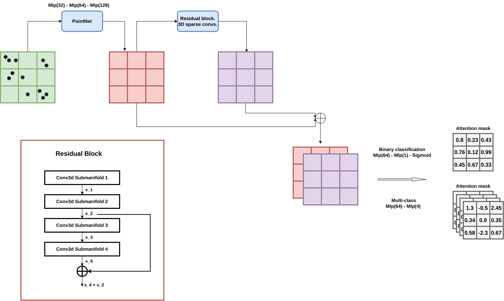
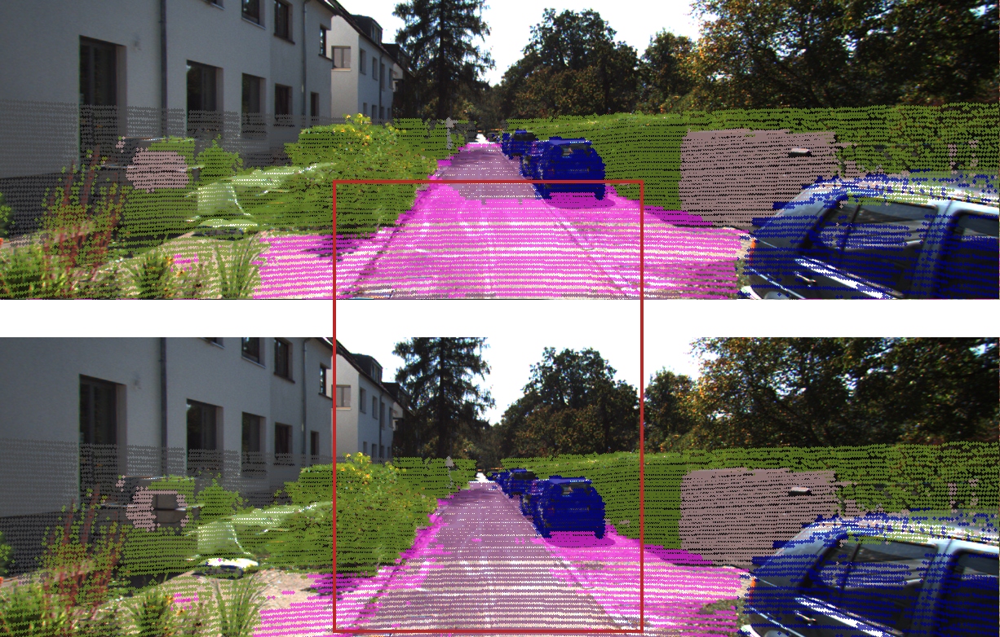
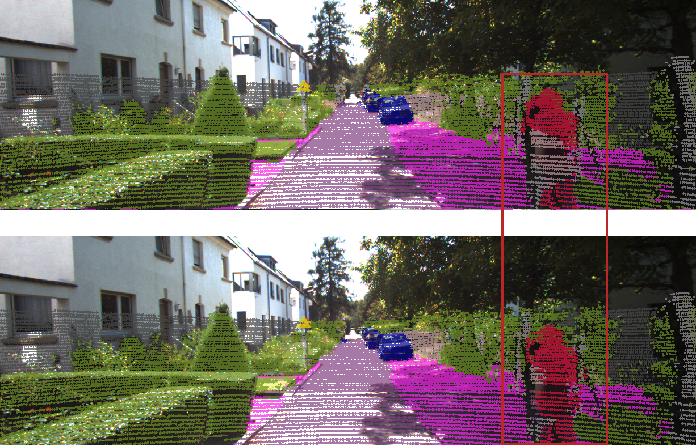

# Semantic Fusion

## Multimodal Fusion with Adaptive Attention for 3D Semantic Segmentation.

This project started as an unofficial code implementation of [FusionPainting][1] for my master's thesis, but ended up being something completely different.

## Model diagram

## How it works

The Net is feeded with a vector containing 2D/3D semantic scores and a pointcloud with points in xyz format
(intensity could be added, but it is not implemented right now). With that data, it learns to choose the best source of semantics given each point from a pointcloud. There two differente architectures.
1. The net outputs the result of a sigmoid layer. It either chooses the 3D semantics, or the 2D ones.
2. The output is composed of 4 possible labels. 2D label for that point is correct, 3D label for that point is correct, Both semantics are correct, Neither of the source semantics are correct.

Publication: TODO

## Usage
Train model

`bash train.sh <gpu> <log.txt> <config_path>`

Internally calls train_model.py

* Arg 1: Gpu id that will be used to train the model.
* Arg 2: Logs filename.
* Arg 3: Path to the dataset's configs in yaml format.

Generate labels

`python val_model.py --config_path <dataset.yaml> --model <model.pt> --out_path <out/dataset/labels>`

* config_path: Path to the dataset's configs in yaml format.
* model: Weights from a trained model.
* out_path: Path where output labels are saved.

Build video from labels

`python visualize.py --labels_path <out/dataset/labels>--video <video.avi> --data <dataset/pandaset> --config_path <dataset.yaml>`

* labels_path: Path where labels are located.
* video: Output video path (and name.extension).
* data: Dataset folder.
* config_path: Path to the dataset's configs in yaml format.

## Testing setup
* 2D semantics

  Obtained from [SemanticKITTI][2] and [Segmentron][3] trained with [Cityscapes][4] and projected onto a pointcloud.

* 3D semantics

  Obtained from [SemanticKITTI][2] and [Cylinder][5] or [SqueezeV3][6] 3D.

* Ground Truth

  [SemanticKITTI][2] 3D semantic segmentation ground truth.

## Results
The model is hardly improving the 3D semantics from Cylinder3D in its current state, but the opposite happends when using Squeeze.

### Cylinder3D for 3D semantics

| Model       | mIoU          | Car | Bicyle | Motorcycle | Truck | Person | Rider | Road | Sideway | Building | Fence | Vegetation | Pole | Traffic Sign |
|--------------|---------------|-----------------------|---------------------------|-----------------------------|------------------------|-------------------------|-----------------------|---------------------------|-----------------------|--------------------------|-----------------------|----------------------------|-----------------------|------------------------------------------|
| Cylinder 3D  | 76.1 | 92.1         | 77.8             | 85.1               | 69.4                   | 80.6           | 91.9         | 92.3             | 78.4                  | 78.5            | 20.8                  | 91.5                       | 63.6         | 67.1                            |
| Fusion-1-C3D | 74.9          | 91.1                  | 75.8                      | 84.8                        | 69.3                   | 77.5                    | 91.2                  | 92.2                      | 78.2                  | 78.0                     | 20.9         | 91.5              | 58.8                  | 64.7                                     |
| Fusion-4-C3D | 75.2          | 91.1                  | 75.0                      | 84.9                        | 69.5          | 77.5                    | 91.4                  | 94.4             | 78.6         | 78.1                     | 20.6                  | 91.2                       | 62.9                  | 63.1                                     |

### SqueezeV3 for 3D semantics

| Model       | mIoU          | Car | Bicyle | Motorcycle | Truck | Person | Rider | Road | Sideway | Building | Fence | Vegetation | Pole | Traffic Sign |
|--------------|---------------|-----------------------|---------------------------|-----------------------------|------------------------|-------------------------|-----------------------|---------------------------|-----------------------|--------------------------|-----------------------|----------------------------|-----------------------|------------------------------------------|
| SqueezeV3     | 68.6                 | 79.6                  | 78.4             | 84.6               | 92.2          | 62.8           | 83.0                  | 94.6                      | 79.4         | 63. 8                    | 13.2                  | 83.2                       | 31.9                  | 45.8                                     |
| Fusion-1-SQ | 69.2        | 80.6                  | 73.9                      | 84.3                        | 89.8                   | 61.4                    | 84.4         | 95.4             | 78.2                  | 65.7            | 13.7         | 84.8                       | 37.0         | 50.7                            |
| Fusion-4-SQ | 68.8                 | 80.7         | 72.5                      | 84.1                        | 88.5                   | 60.7                    | 84.3                  | 95.1                      | 78.8                  | 65.6                     | 13.7                  | 85.0              | 37.0                  | 49.1                                     |

### Fusion examples using Squeeze

Pedestrian improvements:

Road improvements:

[1]: https://arxiv.org/pdf/2106.12449.pdf
[2]: https://arxiv.org/abs/1904.01416
[3]: https://github.com/LikeLy-Journey/SegmenTron
[4]: https://arxiv.org/abs/1604.01685
[5]: https://arxiv.org/pdf/2008.01550.pdf
[6]: https://github.com/chenfengxu714/SqueezeSegV3
